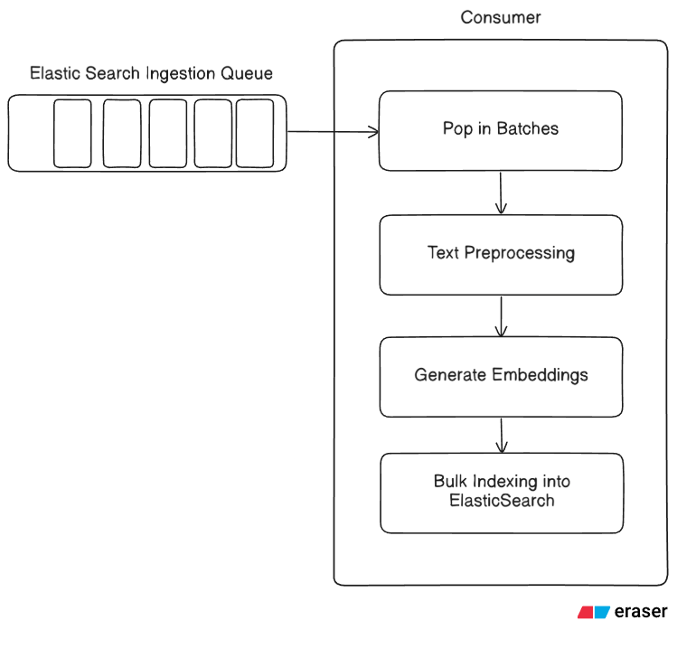
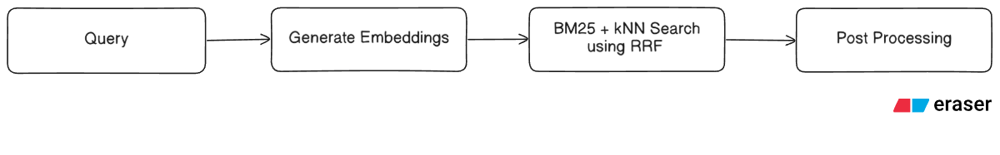

# Crawler Search Pipeline

## Overview

Crawler Search Pipeline is a hybrid search system that enables **BM25 + kNN search** on crawled documents received from a queue. This project combines full-text search capabilities with semantic search using embeddings to provide comprehensive document retrieval. Results are intelligently merged using **Reciprocal Rank Fusion (RRF)** to optimize relevance.

## Key Features

- **Hybrid Search**: Combines BM25 (lexical search) and kNN (semantic search) for better relevance
- **Reciprocal Rank Fusion (RRF)**: Intelligently merges BM25 and kNN results for optimal ranking
- **Queue-Based Ingestion**: Processes documents from a message queue (Redis)
- **Semantic Embeddings**: Uses Hugging Face Inference API for generating document embeddings
- **Text Preprocessing**: Intelligent text normalization and validation
- **Elasticsearch Integration**: Stores and indexes documents with embeddings for efficient retrieval

## Architecture

### System Diagrams

#### Ingestion Pipeline


#### Query Pipeline


## Project Structure

```
├── consumer.py              # Main consumer that processes documents from the queue
├── data.py                  # Sample data for initial development and testing
├── elastic_search.py        # Elasticsearch operations and search logic
├── embeddings.py            # Hugging Face API integration for generating embeddings
├── text_processor.py        # Text preprocessing and normalization
├── search.py                # Testing and validation of search functionality
├── main.py                  # Initial development and testing entry point
├── requirements.txt         # Project dependencies
└── pics/                    # Architecture diagrams
    ├── ingestion.png        # Document ingestion flow
    └── query.png            # Search query flow
```

## Components

### **consumer.py**
The main consumer service that:
- Listens to a message queue (Redis) for incoming documents
- Receives crawled documents from external sources
- Orchestrates the ingestion pipeline (preprocessing → embedding → indexing)

### **text_processor.py**
Preprocessing module that:
- Extracts title, excerpt, and description from raw documents
- Validates excerpt content (removes invalid/garbage/empty content)
- Normalizes description to top 300 characters without escape characters and multiple gaps
- Cleans and prepares text for embedding generation

### **embeddings.py**
Embedding generation module that:
- Integrates with Hugging Face Inference API
- Generates vector embeddings for preprocessed text
- Uses a lightweight model suitable for small documents
- Selected for optimal balance between quality and efficiency

### **elastic_search.py**
Elasticsearch operations module that:
- Manages document indexing with both text and embeddings
- Implements BM25 full-text search queries
- Implements kNN semantic search queries
- Provides hybrid search combining both approaches using Reciprocal Rank Fusion
- Handles document storage and retrieval

### **search.py**
Testing and validation module for:
- Verifying search functionality
- Testing BM25 queries
- Testing kNN queries
- Validating hybrid search results with RRF

### **data.py**
Sample dataset for:
- Initial development and testing
- Prototyping without live data sources
- Validating pipeline components

### **main.py**
Entry point for initial development and manual testing

## Dependencies

- **elasticsearch**: Elasticsearch Python client
- **redis**: Message queue for document ingestion
- **requests**: HTTP client for Hugging Face API
- **python-dotenv**: Environment variable management

See `requirements.txt` for complete dependency list.

## Installation

1. Clone the repository:
```bash
git clone <repository-url>
cd Crawler-Search-Pipeline
```

2. Create and activate virtual environment:
```bash
python -m venv .venv
source .venv/bin/activate  # On Windows: .venv\Scripts\activate
```

3. Install dependencies:
```bash
pip install -r requirements.txt
```

4. Set up Elasticsearch and Kibana locally:

To set up Elasticsearch and Kibana locally, run the start-local script:

```bash
curl -fsSL https://elastic.co/start-local | sh
```

After running the script, you can access Elastic services at the following endpoints:
- **Elasticsearch**: http://localhost:9200
- **Kibana**: http://localhost:5601

## Configuration

Create a `.env` file with the following variables:

```
# Elasticsearch
ELASTICSEARCH_API_KEY=your_elasticsearch_api_key
ELASTICSEARCH_HOST=http://localhost:9200

# Redis
REDIS_URL=redis://localhost:6379
REDIS_QUEUE_NAME=job_queue
REDIS_POLL_TIMEOUT_SECONDS=5
BATCH_SIZE=20

# Hugging Face API
HF_TOKEN=your_huggingface_token
```

## Usage

### Start the Consumer
```bash
python consumer.py
```
This will start listening to the Redis queue and process documents as they arrive.

### Run Search Tests
```bash
python search.py
```
Test the search functionality with sample queries.

### Development/Manual Testing
```bash
python main.py
```

## Pipeline Flow

### Document Ingestion
1. Consumer receives document from Redis queue
2. Text Processor cleans and extracts relevant fields
3. Embeddings module generates vector representations
4. Elasticsearch stores document with both BM25 index and vector embeddings

### Document Search
1. Query is received from user
2. Text Processor normalizes the query
3. Two parallel search paths:
   - **BM25**: Full-text lexical search on indexed text
   - **kNN**: Vector semantic search on embeddings
4. Results are merged using **Reciprocal Rank Fusion (RRF)**:
   - RRF combines rankings from both BM25 and kNN searches
   - Each result is scored based on its rank in each result set
   - Final ranking balances lexical and semantic relevance
5. Merged results returned to user, ordered by RRF score

## Reciprocal Rank Fusion (RRF)

RRF is a data fusion technique that combines multiple ranking algorithms without requiring their individual scores. The formula used is:

```
RRF(d) = Σ(1 / (k + rank(d)))
```

Where:
- `d` is a document
- `k` is a constant (typically 60, configurable)
- `rank(d)` is the rank of document `d` in each result set

This approach ensures that:
- Documents ranked highly in either BM25 or kNN get boosted
- The hybrid ranking is more robust than relying on a single algorithm
- Results balance between keyword relevance and semantic similarity

## Related Projects

- **Web Crawler**: The crawler that feeds documents into this pipeline: https://github.com/MonarchRyuzaki/Web-Crawler

## Technologies

- **Python 3.10+**: Core language
- **Elasticsearch**: Distributed search engine
- **Redis**: Message queue for document ingestion
- **Hugging Face**: Inference API for embeddings (using `all-MiniLM-L6-v2`)
- **Docker**: Containerization (via Elasticsearch start-local script)

## Performance Considerations

- **Model Selection**: `all-MiniLM-L6-v2` model chosen for balance between quality and efficiency with small documents (384-dimensional embeddings)
- **Batch Processing**: Consumer processes batches of documents for optimal throughput
- **RRF Parameters**: Adjust `rank_window_size` and `rank_constant` in `search.py` for different ranking behaviors
- **Caching**: Consider caching embeddings for frequently accessed documents
- **Index Optimization**: Elasticsearch index settings should be tuned for your document volume

## Development Status

### Completed ✓
- Text Preprocessing Function
  - Title, excerpt, and description extraction
  - Excerpt validation and garbage content removal
  - Description normalization (top 300 chars, cleaned)
- Embedding Generation via Hugging Face
- Elasticsearch integration with document storage
- Hybrid search with BM25 + kNN via RRF
- Queue-based consumer with batch processing

### In Progress / Future
- Refer to `TODO.txt` for upcoming features and improvements

## Support

For issues or questions, please open an issue in the repository.
